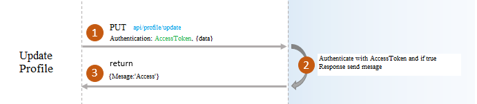
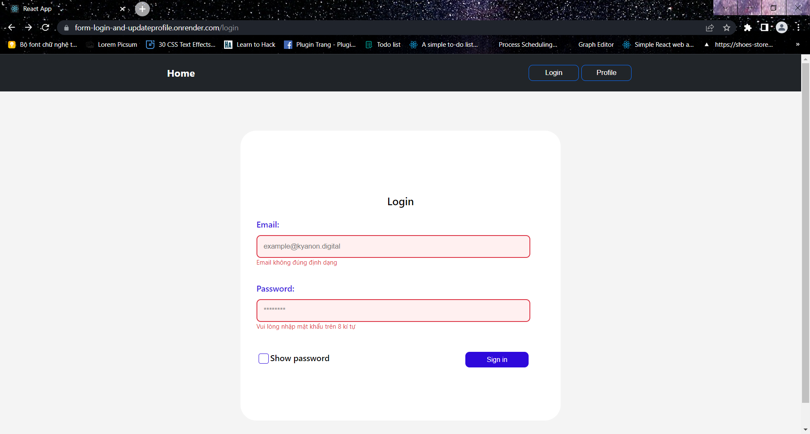
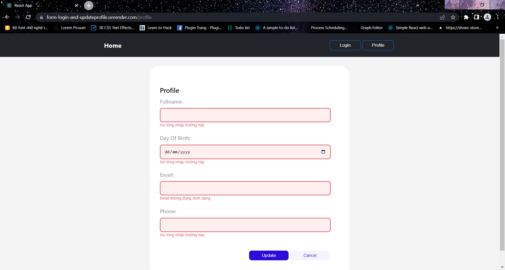

# React web form login and form update profile

This project was React js with typescript, sass, react-router-dom

## Link demo
Link : https://form-login-and-updateprofile.onrender.com

## User Login Diagram

## Describe how to login the user.
- The App component is a container with React Router (BrowserRouter).
- Home component is public for all visitor.
- Basing on the state, the navbar can display its items.
- When web active, data is stored on Local Storage automatically.
- Fisrt, Login components have form for data submission.
- After,Login components is checked.
- Next, they call methods from Auth.tsx to make login request.
- Finally, Auth.tsx get data from Local Storage. Auth.tsx check username, password and response access login or failture.

## Data example
```
data=[
    {
        username:'admin@gmail.com',
        password:'12345678'
    },
    {
        username:'user@gmail.com',
        password:'87654321'
    }
]
```
## User Login and User Update Flow 



## Project Structure


## Run project in local
First, you open terminal in Vscode and run the command:
### git clone https://github.com/letantai3001180588/react-typescript-example.git

Next,in the project directory, you can run:
### `npm i`
### `cd my-app`
### `npm start`

Runs the app in the development mode.\
Open [http://localhost:3000](http://localhost:3000) to view it in the browser.

## Layout 

- Form login


- Validate login


- Form update profile


- validate update profile


The page will reload if you make edits.\
You will also see any lint errors in the console.

### `npm test`

Launches the test runner in the interactive watch mode.\
See the section about [running tests](https://facebook.github.io/create-react-app/docs/running-tests) for more information.

### `npm run build`

Builds the app for production to the `build` folder.\
It correctly bundles React in production mode and optimizes the build for the best performance.

The build is minified and the filenames include the hashes.\
Your app is ready to be deployed!

See the section about [deployment](https://facebook.github.io/create-react-app/docs/deployment) for more information.

### `npm run eject`

**Note: this is a one-way operation. Once you `eject`, you can’t go back!**

If you aren’t satisfied with the build tool and configuration choices, you can `eject` at any time. This command will remove the single build dependency from your project.

Instead, it will copy all the configuration files and the transitive dependencies (webpack, Babel, ESLint, etc) right into your project so you have full control over them. All of the commands except `eject` will still work, but they will point to the copied scripts so you can tweak them. At this point you’re on your own.

You don’t have to ever use `eject`. The curated feature set is suitable for small and middle deployments, and you shouldn’t feel obligated to use this feature. However we understand that this tool wouldn’t be useful if you couldn’t customize it when you are ready for it.

## Learn More

You can learn more in the [Create React App documentation](https://facebook.github.io/create-react-app/docs/getting-started).

To learn React, check out the [React documentation](https://reactjs.org/).
